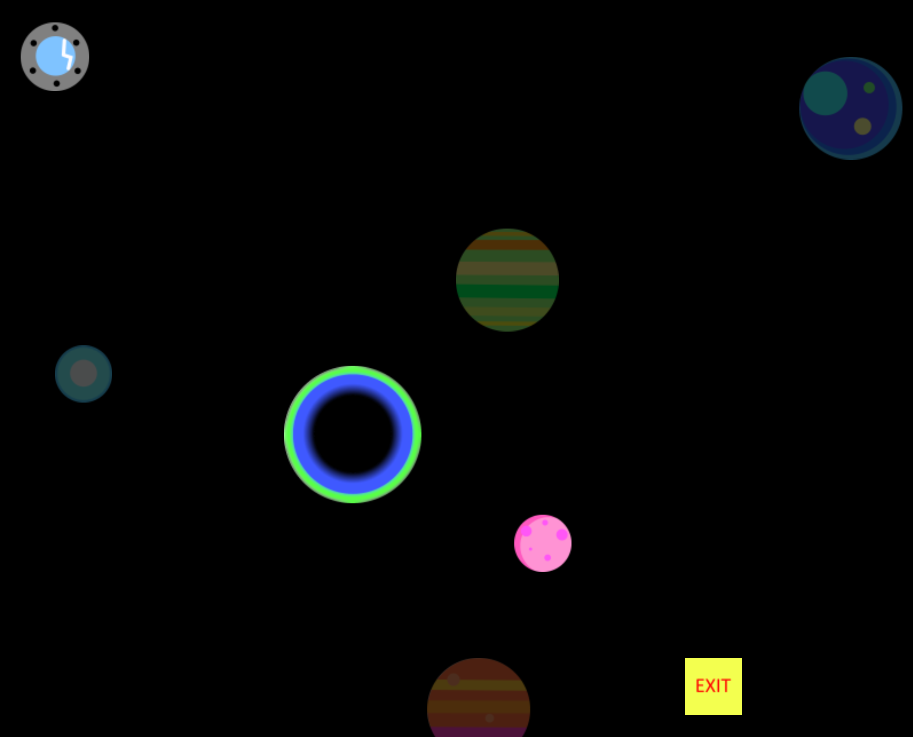

# Space
Projet informatique 1A
Tuteur : François Trahay

Projet de développement d'un jeu vidéo. Vous contrôlez un vaisseau spatial qui n'a plus de carburant :(
Cependant vous avez le super pouvoir de contrôler les **champs gravitationelles** des astres et des planètes :).
Pour réussir à gagner chaque niveau vous devrez faire preuve de réflexion et de réflexe pour faire passer le vaisseau d'un point A à un point B sans entrer en collision avec les planètes et les astres.

Ce projet utilise JavaFX pour le menu.
